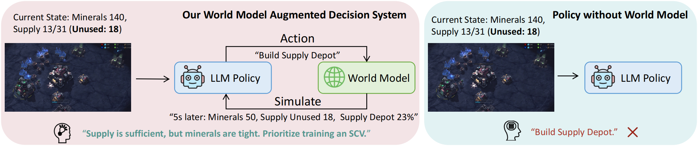
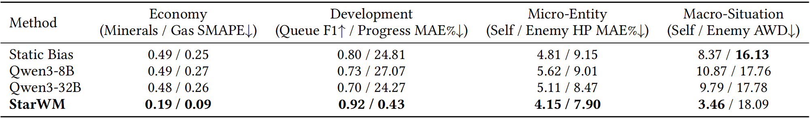
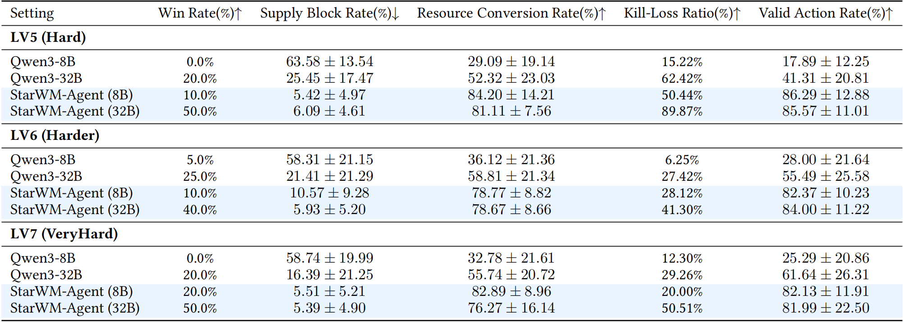

# World Models for Policy Refinement in StarCraft II

<p align="center">
  <a href="https://arxiv.org/abs/2602.14857"></a>
  <a href="https://huggingface.co/yxzhang2024/StarWM"></a>
  <a href="https://huggingface.co/datasets/yxzhang2024/SC2-Dynamics-50K"></a>
</p>

> This repository is the official implementation of the paper: **[World Models for Policy Refinement in StarCraft II](https://arxiv.org/abs/2602.14857)**.

## 🔥 News

- **2026-08-26:** The **revised version** of our paper is now available on [arXiv](https://arxiv.org/abs/2602.14857).
- **2026-08-21:** Our paper has been accepted by **EMNLP 2026** as a **main conference paper**! 🎉

## 🌍 Overview

We study world models for complex partially observable competitive environments, using StarCraft II (SC2) as a challenging testbed.

We propose StarWM, a player-view, action-conditioned world model for SC2, and StarWM-Agent, a world-model-augmented decision system for inference-time policy improvement. 

We conduct extensive offline and online experiments to study the **learnability** and **decision utility** of StarWM, while also characterizing the **boundaries** of the current formulation.

Specifically, we:

1. First introduce a **structured textual representation** that factorizes SC2 observations into five semantic modules based on distinct evolution mechanisms in SC2.
2. Then construct **SC2-Dynamics-50K**, a trajectory-based instruction-tuning dataset for SC2 dynamics prediction, and train StarWM via supervised fine-tuning on Qwen3-8B.
3. Develop a **multi-dimensional evaluation framework** tailored to SC2's hybrid dynamics, and conduct offline experiments to evaluate world-model prediction across economy, development, micro-entity, and macro-situation.
4. Develop **StarWM-Agent**, which integrates StarWM into a lightweight Generate–Simulate–Refine loop for foresight-driven policy refinement, and conduct online experiments to evaluate the decision utility of the learned world model.

<p align="center">
  
</p>

## 🎯 Key Results
### 1. Learnability of SC2 Dynamics

> **RQ1: Can a trajectory-trained, action-conditioned world model capture the hybrid dynamics of SC2?**

StarWM substantially outperforms zero-shot LLM baselines across multiple dimensions, including economy, development, micro-entity, and self-side macro-situation. Meanwhile, the learned dynamics also generalize to an unseen map and a held-out opponent without retraining.

<p align="center">
  <br>
  <em>Table 1: Offline evaluation results in the main setting.</em>
</p>

### 2. Decision Utility of StarWM

> **RQ2: Does integrating a learned world model into the decision loop improve overall decision-making performance?**

StarWM-Agent achieves consistent win-rate gains of +30%, +15%, and +30% against the SC2 built-in AI at Hard (LV5), Harder (LV6), and VeryHard (LV7), respectively, while also improving macro-management and micro-tactical metrics.

Ablation studies further show that StarWM provides additional gains beyond policy self-refinement and zero-shot world-model simulation, highlighting the benefit of more accurate action-conditioned simulation for policy improvement. Moreover, we find that world-model simulation is complementary to existing history-summarization methods, with their combination achieving the strongest online performance in our evaluation.

<p align="center">
  <br>
  <em>Table 2: Online evaluation results in the main setting.</em>
</p>

### 3. Current Boundaries

Our analyses also shed light on the current boundaries of the formulation and point to two promising directions for future work:

1. Modeling under partial observability: Single-frame prediction is inherently challenging under Fog of War, especially for enemy-side dynamics. We find that incorporating temporal history substantially improves prediction, suggesting that stronger temporal memory and belief-state modeling may further improve prediction under partial observability.
2. Longer prediction horizons: We find that prediction at longer horizons does not completely collapse but becomes considerably more difficult, suggesting the need for multi-scale prediction or temporal abstraction for more reliable long-horizon prediction.

Overall, we believe this work provides useful insights for the community and motivates future research on world models for complex partially observable competitive environments.

## 📑 Table of Contents

- [Overview](#-overview)
- [Key Results](#-key-results)
- [Installation](#️-installation)
- [Datasets & Models](#-datasets--models)
- [Quick Start](#-quick-start)
  - [(Optional) World Model Training](#-optional-world-model-training)
  - [Offline Inference](#-offline-inference)
  - [Offline Evaluation](#-offline-evaluation)
  - [Online Testing](#-online-testing)
- [Citation](#-citation)

## 🛠️ Installation

First, clone this repository:
```bash
git clone https://github.com/yxzzhang/StarWM.git
cd StarWM
```

Create a new conda environment with Python 3.12 and install the required dependencies:

```bash
conda create -n StarWM python=3.12 -y
conda activate StarWM
pip install -r requirements.txt
```

## 📥 Datasets & Models

Download the `SC2-Dynamics-50K` dataset from Hugging Face:

```bash
hf download --repo-type dataset yxzhang2024/SC2-Dynamics-50K --local-dir ./data/
```

The dataset contains:
- `wm_train_horizon5.json`
- `wm_val_horizon5.json`
- `wm_test_horizon5.json`

Download the `StarWM` model from Hugging Face:

```bash
hf download yxzhang2024/StarWM --local-dir path/to/your/local/dir
```

You can deploy this model using vLLM for inference.


## 🚀 Quick Start
### 🤖 (Optional) World Model Training

If you prefer to train StarWM yourself instead of downloading the released model, we provide instructions below using [LLaMA-Factory](https://github.com/hiyouga/LLaMA-Factory) for training.

You need to copy the `SC2-Dynamics-50K` dataset to the LLaMA-Factory data directory.

```bash
# Create the directory
mkdir -p train/LLaMA-Factory/data/SC2-Dynamics-50K

# Copy the files
cp data/*.json train/LLaMA-Factory/data/SC2-Dynamics-50K/
```

After preparation, the directory structure should look like this:

```
StarWM/
├── data/
│   ├── wm_train_horizon5.json
│   ├── ...
├── train/
│   └── LLaMA-Factory/
│       └── data/
│           └── SC2-Dynamics-50K/
│               ├── wm_train_horizon5.json
│               ├── ...
```

#### 1. Training

Modify `train/train_starwm.sh` to set your `model_name_or_path` and `output_dir`.

Navigate to the LLaMA-Factory directory to run the training script:

```bash
cd train/LLaMA-Factory
bash ../train_starwm.sh
```

#### 2. Merge LoRA Weights

After training, you need to merge the LoRA weights.
Modify `examples/merge_lora/qwen3_lora_sft.yaml` with your paths, then run:

```bash
llamafactory-cli export examples/merge_lora/qwen3_lora_sft.yaml
```

Then deploy this model using vLLM for inference.

### 🔮 Offline Inference

Inference scripts are located in `offline_infer/`.

1. Deploy your merged model or the StarWM using vLLM (compatible with OpenAI API).
2. Edit `offline_infer/run_experiment_wm.sh` to set:
   - `API_BASE`: Your vLLM server address (e.g., `http://localhost:8000/v1`)
   - `API_KEY`: Your API key (if any, else `EMPTY`)
   - `MODEL_NAME`: The model name served by vLLM

Run the inference:

```bash
# Run from the project root
bash offline_infer/run_experiment_wm.sh
```

### 🧾 Offline Evaluation

Evaluation scripts are in `offline_evaluate/`.

#### General Usage

Edit `offline_evaluate/run_eval.sh` (lines 3-9) to point to your inference output files, then run:

```bash
bash offline_evaluate/run_eval.sh
```

#### Paper Replication

To replicate the results from the paper (Figures 3–5, Tables 1 and 4), you can use the specific commands provided below.

**Reproduce Figures 3–5 (Offline Evolution of AWD & Case Study):**
```bash
python offline_evaluate/run_eval.py \
    --wm_file offline_infer/starwm_output_1traj/WM-final_nothink_results.jsonl \
    --zeroshot_32b_file offline_infer/starwm_output_1traj/Qwen3-32B_nothink_results.jsonl \
    --zeroshot_8b_file offline_infer/starwm_output_1traj/Qwen3-8B_nothink_results.jsonl \
    --output_dir offline_evaluate/starwm_results \
    --plot \
    --figure2_frames 384 365
```

**Reproduce Tables 1 and 4 (Offline evaluation results):**
```bash
python offline_evaluate/run_eval.py \
    --wm_file offline_infer/starwm_output/WM-final_nothink_results.jsonl \
    --zeroshot_32b_file offline_infer/starwm_output/Qwen3-32B_nothink_results.jsonl \
    --zeroshot_8b_file offline_infer/starwm_output/Qwen3-8B_nothink_results.jsonl \
    --static_bias_file offline_infer/starwm_output/static_bias_results.jsonl \
    --output_dir offline_evaluate/starwm_results
```

### 🎮 Online Testing

The online testing component is built on the SC2Arena platform. As the SC2Arena codebase has not yet been publicly released, we are currently seeking permission from the SC2Arena authors for open-sourcing the related code and will release it once approval is granted.

## 📚 Citation

If you find this work useful, please cite our paper:

```bibtex
@misc{zhang2026worldmodels,
      title={World Models for Policy Refinement in StarCraft II}, 
      author={Yixin Zhang and Ziyi Wang and Yiming Rong and Haoxi Wang and Jinling Jiang and Shuang Xu and Haoran Wu and Shiyu Zhou and Bo Xu},
      year={2026},
      eprint={2602.14857},
      archivePrefix={arXiv},
      primaryClass={cs.AI},
      url={https://arxiv.org/abs/2602.14857}, 
}
```
